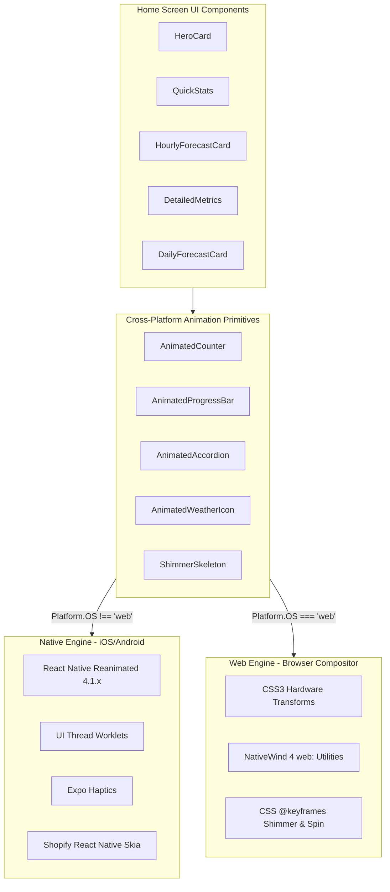

# CMEWS Home Page Motion & Animation Architecture Report (Web & Mobile)

An in-depth analysis and technical blueprint for elevating the **CMEWS** Home Screen into a fluid, state-of-the-art weather experience across **Web (Desktop & Mobile Web)** and **Native Mobile (Android & iOS)**.

---

## 1. Executive Summary & Motion Philosophy

Modern premium weather applications (e.g., Apple Weather, Carrot Weather, Linear) feel responsive and "alive" through **purposeful micro-interactions, atmospheric immersion, and smooth state interpolation**.

Currently, the CMEWS Home Screen ([app/(tabs)/index.tsx](../app/(tabs)/index.tsx)) is functional but visually static:
- Temperatures, humidity, and wind metrics snap instantly on data fetch/refresh.
- Weather icons are static SVG glyphs inside static circular containers.
- The hero card background does not reflect current weather atmosphere dynamically.
- Accordions toggle open/close with abrupt boolean mounting (`{isOpen && ...}`).
- The humidity progress bar and 7-day temperature range bars render without spring expansion.
- Refreshing weather data provides no tactile or visual icon rotation feedback.

### Core Objectives
1. **Atmospheric Immersion**: Condition-aware dynamic ambient gradients and subtle idle icon kinetics.
2. **Smooth Data Choreography**: Spring-interpolated number counting, gauge filling, and compass rotation.
3. **Cross-Platform Dual-Engine Architecture**:
   - **Native (Android & iOS)**: 60/120fps UI-thread worklets via `react-native-reanimated` 4.1.x with zero JS-thread blocking.
   - **Web (Desktop & Mobile Web)**: Hardware-accelerated CSS3 transitions and keyframes (`web:transition-all`, `web:hover:`) executing in the browser compositor thread with zero JS overhead.
4. **Platform Invariant Compliance**: Strictly adhere to `.agents/AGENTS.md` guidelines (e.g., `web:` scoping for NativeWind 4 transition classes to avoid Android runtime crashes).

---

## 2. Component-by-Component Opportunity Analysis

```mermaid
graph TD
    A[Home Page Motion System] --> B[Atmospheric Dynamics]
    A --> C[Data Kinetics & Counters]
    A --> D[Interactive Choreography]
    A --> E[Loading & Feedback]

    B --> B1[Hero Weather Gradient Glow]
    B --> B2[Micro-animated Weather Icons]
    B --> B3[Hazard Warning Subtle Pulse]

    C --> C1[Smooth Temperature Number Roll-Up]
    C --> C2[Humidity Progress Spring Fill]
    C --> C3[Wind Direction Arrow Rotational Spring]
    C --> C4[7-Day Temperature Range Bar Expansion]

    D --> D1[Staggered Hourly Pill Entrance]
    D --> D2[Accordion Smooth Height Expand/Collapse]
    D --> D3[Alert Slide-Out & Height Collapse]
    D --> D4[Desktop Web Card Hover Elevation]

    E --> E1[Continuous Refresh Icon Spin]
    E --> E2[Linear/iOS Wave Shimmer Skeleton]
    E --> E3[Location Pin Bounce on Update]
```

### 1. Hero Weather Card ([components/weather/hero-card.tsx](../components/weather/hero-card.tsx))
- **Dynamic Atmosphere Backdrop**: Dynamic gradient shifts tailored to current conditions:
  - *Cerah (Sunny)*: Amber/golden sky gradient with a soft breathing sun corona glow.
  - *Hujan (Rainy)*: Deep navy-slate gradient with subtle misty shimmer.
  - *Berawan (Cloudy)*: Multi-tone azure/slate gradient with slow horizontal drift.
  - *Petir (Thunderstorm)*: Moody violet gradient with rare soft electric highlights.
- **Animated Temperature Roll-Up**: Temperature number smoothly counts from old value to new value over 400ms using spring interpolation.
- **Micro-Animated Weather Icons ([components/weather/weather-icon.tsx](../components/weather/weather-icon.tsx))**:
  - *Sun*: Ray breathing oscillation ($\pm 15^\circ$) and subtle scale pulse (`1.0` $\leftrightarrow$ `1.05`).
  - *Rain*: Rain droplets translate downward and fade cyclically.
  - *Cloud*: Gentle horizontal floating motion ($\pm 4\text{px}$).

### 2. Location Bar & Refresh ([components/weather/location-selector.tsx](../components/weather/location-selector.tsx))
- **Continuous Spinning Refresh Icon**: When refreshing via pull-to-refresh or pressing the refresh button, the `RefreshCw` icon spins 360° continuously, then settles with a gentle spring bounce upon completion.
- **Location Pin Spring Bounce**: When the selected region changes, trigger a spring bounce on `MapPin` (`translateY: 0 -> -6px -> 0`).
- **Tactile Touch & Hover**: `web:hover:bg-muted/80 web:transition-all` on desktop and scale press feedback on mobile.

### 3. Quick Stats Cards ([components/weather/quick-stats.tsx](../components/weather/quick-stats.tsx))
- **Humidity Progress Spring Fill**: The horizontal progress bar fills smoothly from `0%` to `${humidity}%` with spring damping on mount and updates.
- **Kinetic Wind Compass ([components/weather/direction-arrow.tsx](../components/weather/direction-arrow.tsx))**: Smoothly rotates the arrow along the shortest angular path to new degrees with spring damping instead of snapping.
- **Desktop Hover Elevation**: `web:hover:-translate-y-1 web:hover:shadow-md web:transition-all web:duration-200` on stat cards.

### 4. Hourly Forecast Strip ([components/weather/hourly-forecast-card.tsx](../components/weather/hourly-forecast-card.tsx))
- **Staggered Entry Cascade**: Hourly pills enter sequentially ($\text{delay} = \text{index} \times 35\text{ms}$), creating an organic wave effect.
- **"Now" Hour Accent Pulse**: Soft highlight and subtle pulse for the current active hour pill.
- **Desktop Pill Hover**: `web:hover:scale-105 web:hover:bg-muted/70 web:transition-all`.

### 5. Detailed Metrics Accordion ([components/weather/detailed-metrics.tsx](../components/weather/detailed-metrics.tsx))
- **Smooth Height Transition**: Replaces abrupt boolean rendering with animated height (`Reanimated LayoutAnimation` on Native, CSS Grid `grid-template-rows: 0fr -> 1fr` on Web).
- **Chevron 180° Rotation**: Smooth rotation spring when toggling open/close.
- **Tactile Haptic Feedback**: Light haptic impact on native mobile when expanding/collapsing.

### 6. 7-Day Forecast Card ([components/weather/daily-forecast-card.tsx](../components/weather/daily-forecast-card.tsx))
- **Spring-Expanding Temperature Range Bars**: Range bars expand outward from origin to their target `[min, max]` span.
- **Layout Collision Fix**: Cleanly separates precipitation icons and low-temperature labels to eliminate overlap on narrow screens.
- **Staggered Row Appearance**: Daily rows enter sequentially with smooth fade-in.

### 7. Weather Alert Banner ([components/weather/weather-alert.tsx](../components/weather/weather-alert.tsx))
- **Hazard Icon Pulse**: Soft breathing pulse on the `AlertTriangle` icon for warning severity.
- **Slide-and-Collapse Dismissal**: Tapping `X` slides the card right (`translateX: 100%`) while collapsing height to `0`, preventing harsh layout jumps.

### 8. Shimmer Skeleton Loading ([components/ui/skeleton.tsx](../components/ui/skeleton.tsx))
- **Wave Shimmer Gradient**: Replaces basic opacity blinking with a diagonal linear gradient sweeping from left to right.

---

## 3. Technical Architecture & Engine Selection

### Engine Selection Matrix

| Feature | Mobile Native (Android / iOS) | Web (Desktop & Mobile Web) | Rationale |
| :--- | :--- | :--- | :--- |
| **Number Counters** | `Reanimated` Worklet with `useDerivedValue` | `requestAnimationFrame` + CSS tabular numbers | 60fps UI thread execution on native; zero bundle/hydration penalty on web. |
| **Progress Fill & Sliders** | `withSpring(progress, { damping: 15 })` | `web:transition-all web:duration-500 ease-out` | Pure CSS transition on web avoids JS bridge overhead entirely. |
| **Compass Rotation** | `useAnimatedStyle` with shortest-arc angle interpolation | CSS `transform: rotate(...)` + `web:transition-transform` | Prevents 360° flip glitches across $0^\circ \leftrightarrow 359^\circ$. |
| **Accordion Expansion** | `Reanimated` LayoutAnimation / animated height | CSS Grid `grid-template-rows: 0fr -> 1fr` + `transition` | Avoids expensive DOM reflows on web; smooth Fabric layout on native. |
| **Weather Icon Kinetics** | `useAnimatedStyle` with `withRepeat(withSequence(...))` | CSS keyframe animations (`animate-pulse`, `animate-bounce-subtle`) | Continuous idle animations offloaded completely from JS thread. |
| **Skeleton Wave Shimmer** | Reanimated `LinearGradient` `translateX` sweep | CSS `@keyframes shimmer` with `linear-gradient` | Premium visual polish matching iOS system standards. |

---

## 4. Platform Invariants & Safety Protocol

1. **NativeWind 4 CSS Scoping (Invariant 7)**:
   - All transition and animation classes must use the `web:` modifier (e.g., `web:transition-all`, `web:hover:scale-105`). Unscoped transition classes crash native Android function components.
2. **App Lifecycle & Battery Conservation**:
   - Idle continuous animations (such as sun ray rotation or ambient glowing) must subscribe to `AppState` / page visibility and pause when the app is backgrounded or when the Home tab is inactive.
3. **Accessibility & Reduced Motion**:
   - Respect `AccessibilityInfo.isReduceMotionEnabled()` on native and `@media (prefers-reduced-motion: reduce)` on web to fall back to instant transitions for users with motion sensitivity.
4. **Decoupled Architecture (Invariant 3)**:
   - Ensure layout transitions do not stall Fabric JS-thread execution.
5. **Non-Destructive Archiving**:
   - Any replaced or refactored components must be moved to `_archive/` with top comments indicating the rationale, rather than being deleted.

---

## 5. Phased Implementation Roadmap

```mermaid
gantt
    title Home Page Motion Implementation Roadmap
    dateFormat  X
    axisFormat  Day %d
    section Phase 1: Primitives
    AnimatedCounter & ProgressBar       :0, 1
    AnimatedAccordion & DirectionArrow  :0, 1
    ShimmerSkeleton Upgrade             :1, 2
    section Phase 2: Core Components
    HeroCard Ambient Background & Kinetics :2, 3
    QuickStats Spring Fill & Numbers       :2, 3
    LocationSelector Refresh Spin & Haptics:3, 4
    section Phase 3: Forecast Cards
    HourlyForecast Staggered Entrance      :4, 5
    DetailedMetrics Smooth Accordion       :4, 5
    DailyForecast Range Bars & Fix         :5, 6
    section Phase 4: Polish & Audit
    WeatherAlert Dismiss Collapse          :6, 7
    Desktop Web Hover Micro-Interactions   :6, 7
    Cross-Platform Performance Verification:7, 8
```

1. **Phase 1: Foundational Animation Primitives**:
   - Build `components/ui/animated-counter.tsx`, `components/ui/animated-progress-bar.tsx`, and `components/ui/shimmer-skeleton.tsx`.
2. **Phase 2: Hero & Quick Stats Transformation**:
   - Implement ambient backdrop gradients in `HeroCard`, idle kinetics in `WeatherIcon`, rotational spring in `DirectionArrow`, and spinning refresh in `LocationSelector`.
3. **Phase 3: Forecast Lists & Detailed Metrics**:
   - Add staggered cascade entry to `HourlyForecastCard`, smooth height transition to `DetailedMetrics`, and spring-expanding bars to `DailyForecastCard`.
4. **Phase 4: Polish, Alert Dismissal & Cross-Platform Verification**:
   - Implement slide-and-collapse in `WeatherAlertCard`, desktop hover states, and verify 60fps performance on Web and Android.
